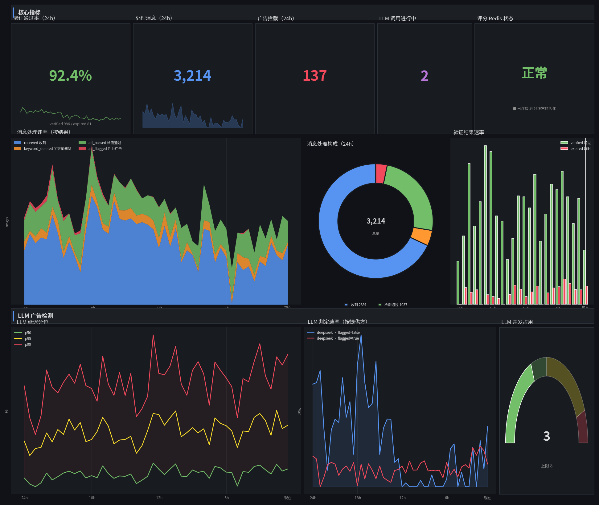

# tg-group-guard Grafana 仪表盘模板

Bot 本身已通过 `/metrics` 端点暴露全部指标(`.env` 设 `ENABLE_METRICS=true` 并
`pip install prometheus_client` 即可)。本目录只提供 **Grafana 仪表盘模板**,
直接导入你已有的 Prometheus + Grafana 环境使用,无需额外搭建任何服务。



> 预览图为按真实面板布局绘制的效果示意(示例数据);`preview_mockup.py` 是生成该图的脚本,仅供维护预览用,使用模板无需运行。

## 一、导入仪表盘

1. 确认你的 Prometheus 已抓取 Bot 指标(见下方抓取配置)。
2. Grafana → **Dashboards → Import** → 上传 `grafana-dashboard.json`。
3. 导入时在数据源下拉框选择你的 Prometheus 数据源,完成。

> 若导入后面板无数据,是数据源 uid 不匹配(模板内引用 uid `tgg-prometheus`)。
> 导入时选对数据源即可自动替换;仍不行的话,用文本编辑器打开 JSON,
> 全局把 `"uid": "tgg-prometheus"` 替换成你数据源的 uid 再导入。

## 二、Prometheus 抓取配置

在你现有的 `prometheus.yml` 中加一个 job:

```yaml
scrape_configs:
  - job_name: "tg-group-guard"
    metrics_path: /metrics
    scrape_interval: 15s
    static_configs:
      - targets: ["<Bot服务器IP>:8000"] # 端口 = .env 的 WEB_PORT
```

重载 Prometheus 后,在 *Status → Targets* 确认该 job 状态为 `UP`,
并能在 Graph 页查到 `telegram_group_guard_bot_messages_total`。

## 三、仪表盘内容(13 个面板)

**核心指标(第一行)**

- 验证通过率(24h)— 百分比,阈值 70% / 90% 变色
- 处理消息数 / 广告拦截数(24h)
- LLM 进行中请求数(实时)
- Redis 状态 — 绿=正常 / 红=降级

**消息与验证**

- 消息处理速率 — 按结果堆叠(收到/关键词删除/检测通过/判为广告)
- 24h 消息构成 — 环形图
- 验证结果速率 — 通过 vs 超时柱状图

**LLM 广告检测**

- LLM 延迟分位数 — p50 / p95 / p99(基于 histogram_quantile)
- LLM 判定速率 — 判为广告单独标红
- LLM 并发 — 仪表,阈值 4 / 7 变色

## 四、指标一览(定义见 `app/metrics.py`)

| 指标 | 类型 | 说明 |
|---|---|---|
| `telegram_group_guard_bot_messages_total{result}` | Counter | 处理消息数(每条消息只计一个互斥标签,可直接跨 label 求和)。`result`: `keyword_deleted` 关键词删除 / `keyword_replied` 关键词回复 / `ad_passed` 检测通过 / `ad_flagged` 判为广告 / `channel_blocked` 频道身份拦截 / `skipped` 前置跳过(合格用户/低分处置/转发等) |
| `telegram_group_guard_bot_verification_total{result}` | Counter | 验证结果。`result`: `verified` 通过 / `expired` 超时 |
| `telegram_group_guard_bot_llm_latency_seconds{provider}` | Histogram | LLM 调用延迟分布 |
| `telegram_group_guard_bot_llm_outcome_total{provider,flagged}` | Counter | LLM 判定结果(`flagged=true` 为判广告) |
| `telegram_group_guard_bot_llm_in_flight` | Gauge | 正在执行的 LLM 请求数 |
| `telegram_group_guard_bot_score_redis_degraded` | Gauge | 评分 Redis 降级标志:`1` 已降级 / `0` 正常 |

## 五、建议告警规则(可选)

接入 Alertmanager 时,可将以下规则加入 Prometheus `rule_files`:

```yaml
groups:
  - name: tg-group-guard
    rules:
      # 评分系统 Redis 降级超过 5 分钟
      - alert: ScoreRedisDegraded
        expr: telegram_group_guard_bot_score_redis_degraded == 1
        for: 5m
        labels: { severity: warning }
        annotations:
          summary: "评分系统 Redis 已降级,成员评分不会持久化"

      # 持续 10 分钟无任何消息流量(Bot 掉线或抓取中断)
      - alert: NoMessageTraffic
        expr: increase(telegram_group_guard_bot_messages_total[5m]) == 0
        for: 10m
        labels: { severity: critical }
        annotations:
          summary: "Bot 超过 10 分钟无任何消息流量,请检查 Bot 与抓取链路"

      # LLM p95 延迟超过 30 秒
      - alert: LLMLatencyHigh
        expr: histogram_quantile(0.95, rate(telegram_group_guard_bot_llm_latency_seconds_bucket[5m])) > 30
        for: 10m
        labels: { severity: warning }
        annotations:
          summary: "LLM 广告检测 p95 延迟过高(>30s),检查 API 供应商状态"
```
